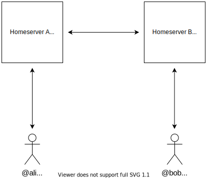
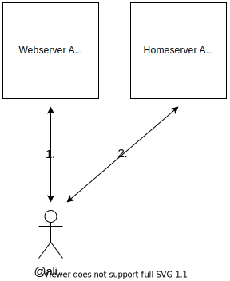
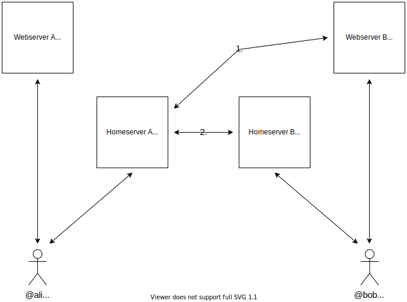

# Domains?

## How Matrix (commonly) works

If you think about the way Matrix works, you will probably have this rough idea in your head:



So as @alice:a.com you are connected to your Matrix Homeserver which is a.com and if you chat with @bob:b.com, your Homeserver talks with Bob's Homeserver, b.com.

But how does your Matrix App know how to talk with your Homeserver, and how does your Homeserver know how to talk with other Homeservers?

## How your Matrix Client finds your Homeserver

1. You open your Matrix Client for the first time and type in your homeserver url: `example.com`.
2. Your Matrix client sends an http(s) request to `example.com/.well-known/matrix/client`.
3. The Webserver answers with a file like this:

```json
{
  "m.homeserver": {
    "base_url": "https://matrix.example.com"
  }
}
```

4. Your Matrix client connects to `https://matrix.example.com` and checks if it is a Matrix home server.
5. You can register and log in as `@alice:example.com`

So the actual homeserver can have a different url (`matrix.example.com`) than the domain in your username (`example.com`). So the sketch from above get's a bit more complicated:



## How your Homeserver finds other Homeservers

Now you want to message `@bob:b.com`. How does your Homeserver know how to talk to bob?

1. You send a message in a chat with `@bob:b.com`.
2. Your Homeserver sends an HTTP request to `b.com/.well-known/matrix/server`.
3. The webserver of `b.com` answers with a file like this:

```json
{
  "m.server": "matrix.b.com:443"
}
```

4. Your homeserver connects to `https://matrix.b.com` on port 443 (the default port for HTTPS) and delivers your message to `@bob:b.com`.

Our diagram got even more complicated:



## Does this need to be this complicated?

The Matrix protocol is rather flexible to allow for big Homeservers with millions of users. This split between your domain (`a.com`) and the actual Homeserver url (`matrix.a.com`) allows to run a Website for `a.com` on one physical server and the Matrix Homeserver on another physical server and other fancy, but complicated magic.

## How to choose a setup for your own Homeserver

So what to do?

You will probably have a fancy domain, let's call it `example.com`.
Your users shall have names like `@chris:example.com` or `@danielle:example.com`.

In our guides, we assume you control the DNS settings for your domain and are able to setup a subdomain.
We also assume that you have a Linux server with a public IP address with ports 443 (and maybe 80) opened up in your firewall and some free disk space.

You should setup a reverse-proxying webserver like nginx, apache, traefik or caddy to

- Serve `https://example.com/.well-known/matrix/client`
- Serve `https://example.com/.well-known/matrix/server`
- Proxy `https://matrix.example.com/` to Conduit

(Again: Substitute example.com with your own, even better domain.)

## Alright, let's get started!

We documented a few routes to get to a working Conduit server. Choose which one you like:

- The manual way (best tested)
- Docker compose
- Docker + Reverse proxy
